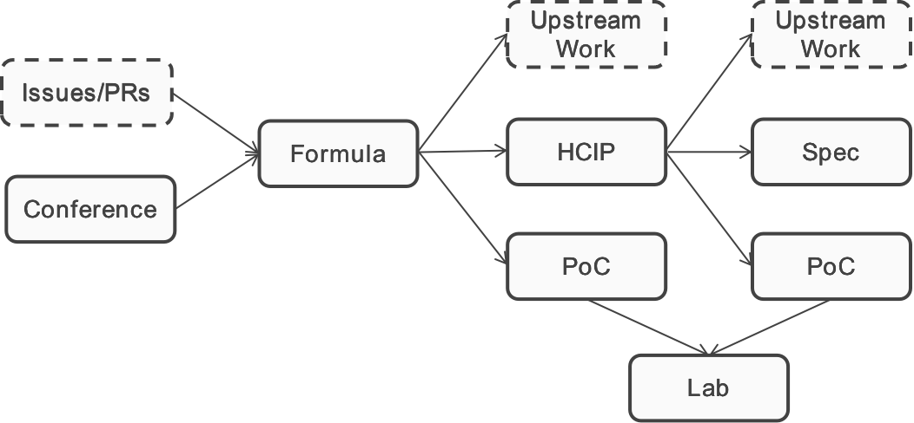

## OHCF Process Workflow

As shown in Figure 2 below, everything in OHCF starts with [Formula](../formula/formula-example.md).

Formula is where we gather or write up design blueprint of a full stack reference implementation of a certain scenario. For example one formula could be the design of how to run a machine learning inference job on a cloud platform powered by OpenStack and Kubernetes with FPGA resource. In the formula the developer will specify what open source components would be needed, what upstream communities would be impacted, what are the versions of the software and hardware we will PoC on, and all the other informations.

The input for a formula design could be directly from an issue/PR, or from discussions happened in a OHCF related [conference](https://github.com/open-heterogeneous-computing-framework/conference).

After a formula is defined, there will be three options going forward:

1) start PoC if there are no gaps identified;

2) go to upstream communities if the gaps are straightforward;

3) write up a [HCIP](https://github.com/open-heterogeneous-computing-framework/HCIP) that describes the holistic requirements for improvements when the gaps are not easily defined.

When we go on the HCIP route, there will also be three outcomes of the HCIP process:

1) with clear defined gaps, go to the upstream communities to fulfill those gaps

2) Draft specification if needed

3) Build PoC which verifies the HCIP for follow up investigations

All the PoC could be materialized in an open lab environment.

